<div align="center">

# 💬 Sawalif ✨

### *A modern real-time messaging app built with Flutter & Firebase*

[](https://flutter.dev)
[](https://dart.dev)
[](https://firebase.google.com)
[](LICENSE)
[](https://github.com/MohamedHamid4)

[Features](#-features) • [Screenshots](#-screenshots) • [Tech Stack](#-tech-stack) • [Setup](#-setup) • [Developer](#-developer)

</div>

---

## 📱 About

**Sawalif** (سوالف - Arabic for "chats") is a feature-rich, production-ready messaging application that brings friends and family together with a smooth, secure chat experience.

Built with **Flutter** following **MVVM architecture** and powered by **Firebase**, Sawalif provides everything users expect from a modern messaging app: real-time messaging, stories, group chats, push notifications, QR code sharing, and more — all wrapped in a beautiful Arabic/English interface with dark mode support.

---

## 📸 Screenshots

<div align="center">

### 🚀 Welcome Experience

<table>
<tr>
<td align="center"><b>Splash Screen</b></td>
<td align="center"><b>Login</b></td>
<td align="center"><b>Create Account</b></td>
</tr>
<tr>
<td>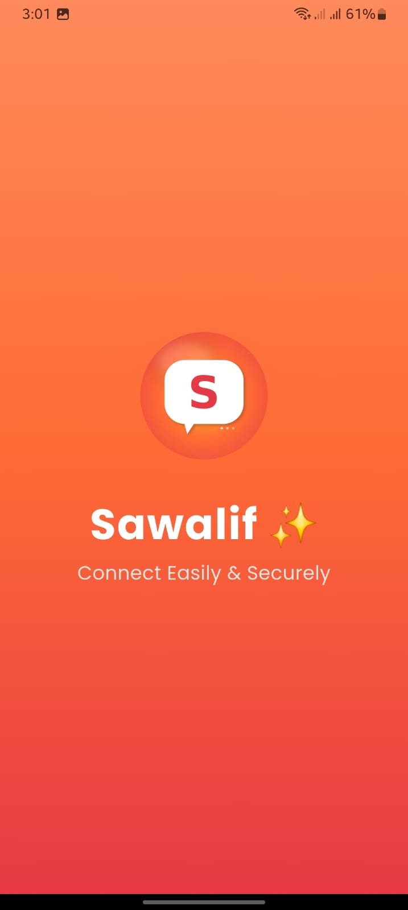</td>
<td>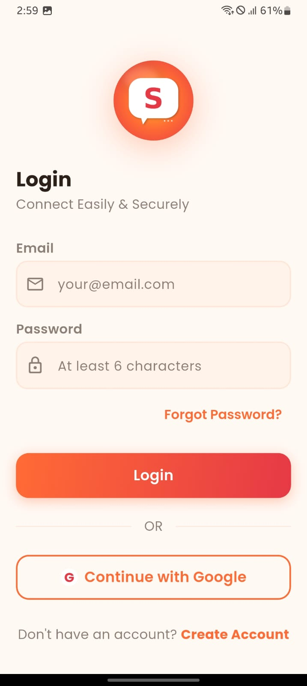</td>
<td>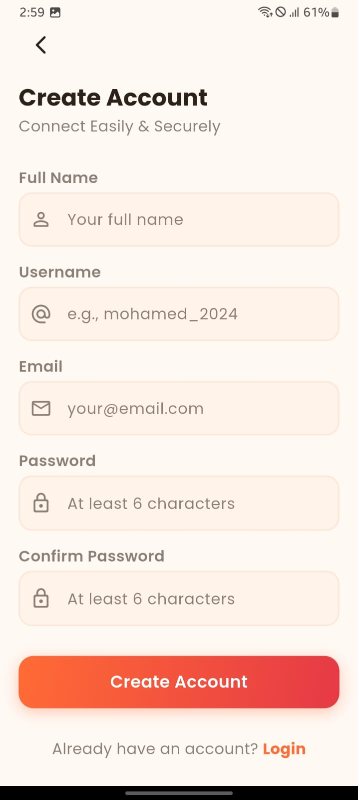</td>
</tr>
</table>

### 💬 Chat Experience

<table>
<tr>
<td align="center"><b>Chats List</b></td>
<td align="center"><b>Add Friend Menu</b></td>
<td align="center"><b>Search by Username</b></td>
</tr>
<tr>
<td>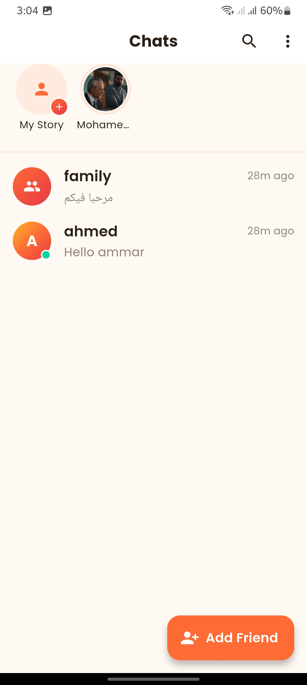</td>
<td>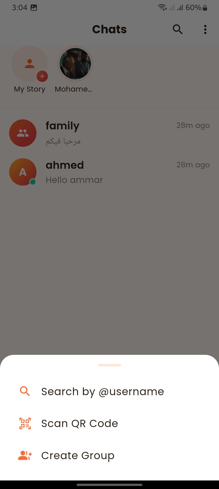</td>
<td>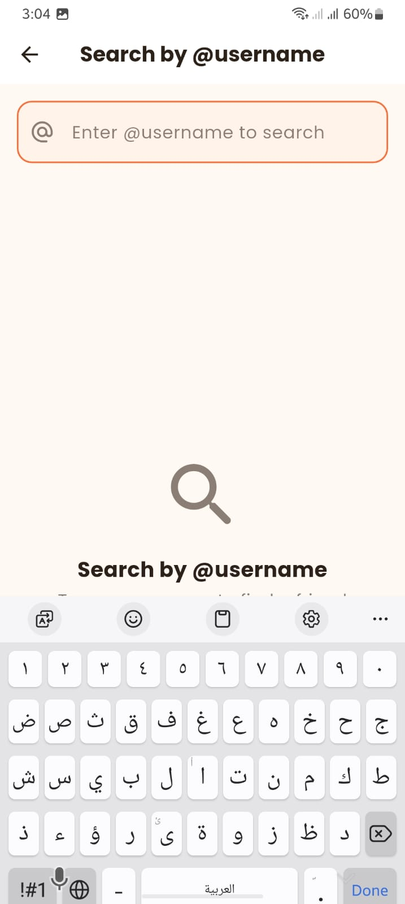</td>
</tr>
</table>

### 👥 Groups & Profile

<table>
<tr>
<td align="center"><b>Create Group</b></td>
<td align="center"><b>Profile + QR</b></td>
<td align="center"><b>Edit Profile</b></td>
</tr>
<tr>
<td>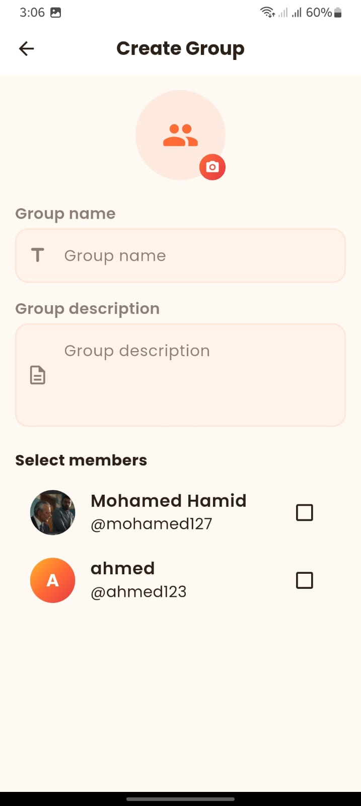</td>
<td>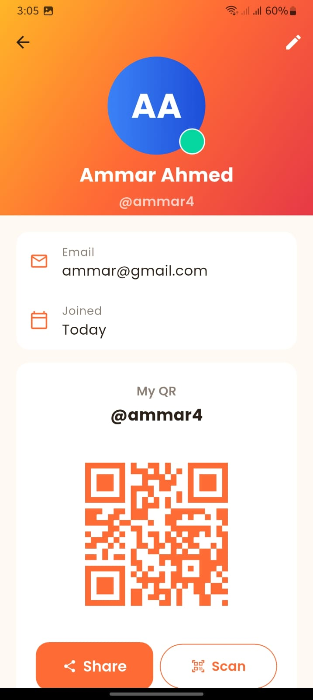</td>
<td>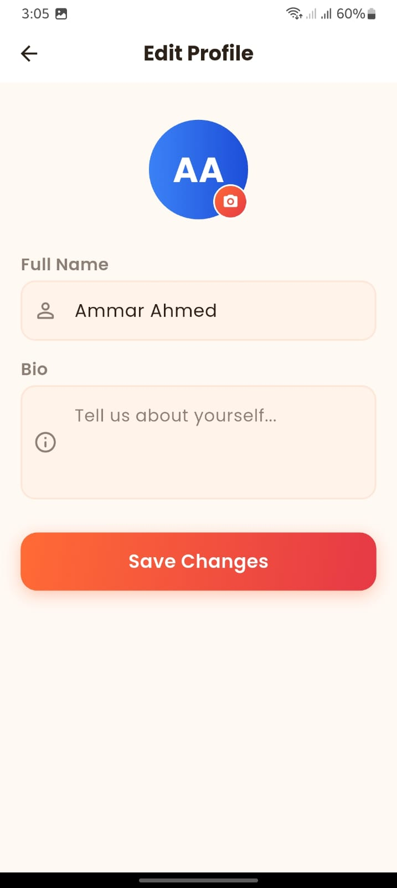</td>
</tr>
</table>

### ⚙️ Settings & Customization

<table>
<tr>
<td align="center"><b>Settings</b></td>
<td align="center"><b>Account Settings</b></td>
<td align="center"><b>About App</b></td>
</tr>
<tr>
<td>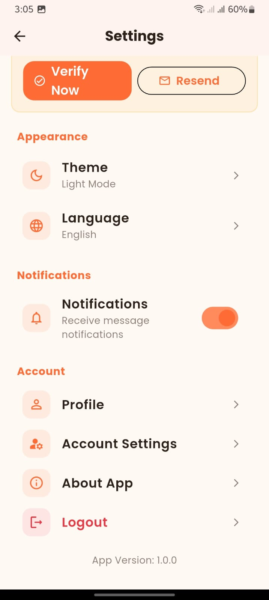</td>
<td>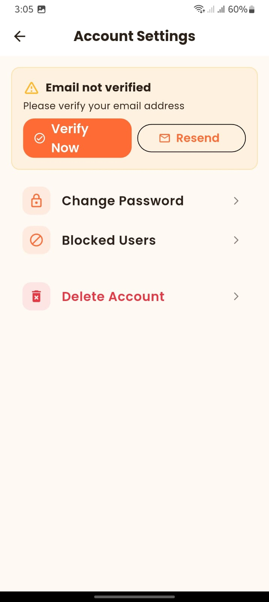</td>
<td>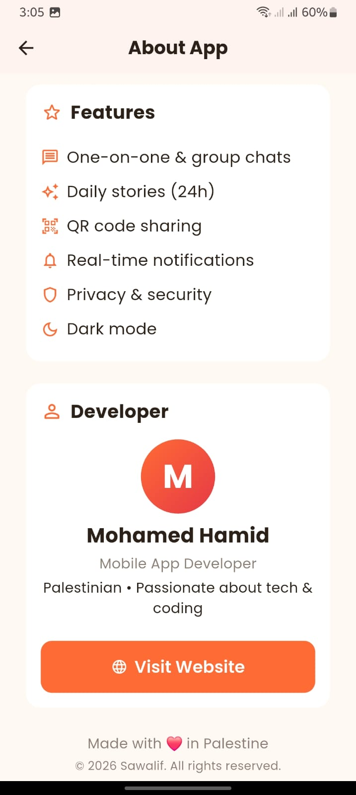</td>
</tr>
</table>

### 🎨 Theme & Language

<table>
<tr>
<td align="center"><b>Dark Mode</b></td>
<td align="center"><b>Language Selection</b></td>
</tr>
<tr>
<td>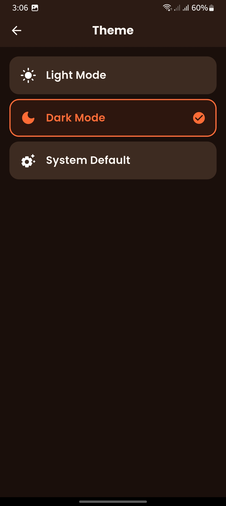</td>
<td>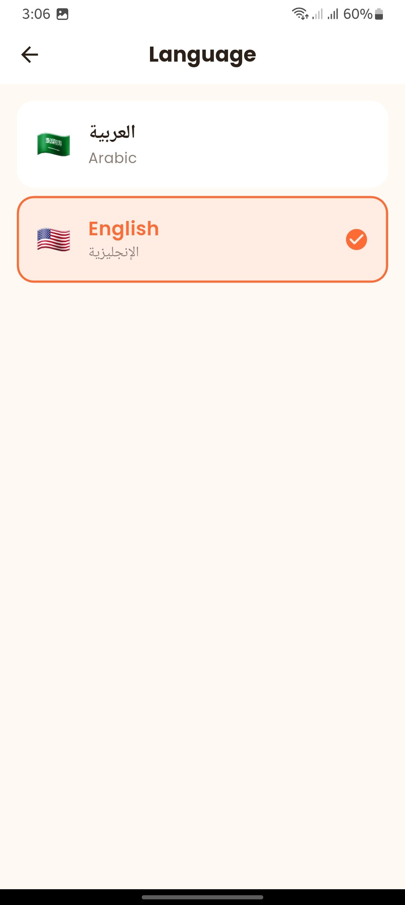</td>
</tr>
</table>

</div>

---

## ✨ Features

### 💬 Messaging
- ⚡ **Real-time text messaging** powered by Cloud Firestore
- 📸 **Image sharing** with caching and lazy loading
- ✓✓ **WhatsApp-style read receipts** (sent → delivered → read)
- ⌨️ **Typing indicators** with smooth animations
- 🟢 **Real-time presence** using Firebase Realtime Database with `onDisconnect()`
- 👥 **Group chats** with admin controls
- 🔍 **In-chat search** for finding old messages
- 🚫 **Block & Report** users for safety
- 🗑️ **Delete messages** for everyone or just yourself
- 💬 **Reply to messages** with quoted preview
- 😀 **Emoji reactions** on messages

### 📸 Stories (24h Auto-deletion)
- 📷 **Multi-image stories** (pick multiple at once)
- 🎨 **WhatsApp-style story rings** (orange gradient = unviewed)
- ⏸️ **Hold to pause** like Instagram/WhatsApp
- 👆 **3-zone tap navigation** (left/center/right)
- ➕ **Add more** to existing stories
- 🗑️ **Delete stories** with confirmation

### 🔐 Authentication & Security
- 🔥 **Firebase Authentication** (Email/Password + Google Sign-In)
- ✉️ **Email verification** with auto-refresh detection
- 🆔 **Username system** with QR code sharing
- 📷 **QR code scanner** to add friends instantly
- 🔑 **Password reset** via email
- 🔒 **Firestore security rules** preventing unauthorized access
- 🚫 **Block & Report** with privacy controls
- 🗑️ **Delete account** option

### 🌐 Internationalization
- 🇸🇦 **Arabic** (RTL) with Arabic-Indic numerals (١٢٣)
- 🇬🇧 **English** (LTR) with Western numerals (123)
- 🌍 **Auto-detect device locale** on first launch
- 🔄 **Mixed-locale interoperability** — Arabic and English users see their own language in the same chat

### 🎨 Design & UX
- 🌅 **Sunset gradient theme** (Orange + Red + Gold)
- 🌙 **Light, Dark & System modes**
- 📱 **Material Design 3**
- 🎬 **Native splash screen** with smooth transition
- ✨ **Custom app icon** with adaptive support
- 📲 **Bottom sheet menus** for actions
- 🎨 **Smooth animations** throughout

### 🔔 Notifications
- 📲 **Push notifications** via OneSignal
- 🔕 **Notification preferences** (toggle on/off)
- 🎯 **Real-time message alerts**

### 🚀 Performance
- ⚡ **Cold start: 1-2 seconds**
- 📦 **APK size: 15-20MB** (split per ABI with R8)
- 💾 **Memory leak-free** (audited subscriptions, controllers, timers)
- 🎯 **60fps smooth animations**
- 🖼️ **Cached network images**

---

## 🛠️ Tech Stack

### 🎯 Core Framework
| Technology | Purpose | Link |
|------------|---------|------|
| **Flutter** | Cross-platform UI framework | [flutter.dev](https://flutter.dev) |
| **Dart** | Programming language | [dart.dev](https://dart.dev) |

### ☁️ Backend & Services
| Technology | Purpose | Link |
|------------|---------|------|
| **Firebase Authentication** | User authentication (Email + Google) | [Docs](https://firebase.google.com/docs/auth) |
| **Cloud Firestore** | Real-time NoSQL database | [Docs](https://firebase.google.com/docs/firestore) |
| **Firebase Realtime Database** | Presence system with `onDisconnect()` | [Docs](https://firebase.google.com/docs/database) |
| **Firebase Cloud Messaging** | Push notification infrastructure | [Docs](https://firebase.google.com/docs/cloud-messaging) |
| **OneSignal** | Notification delivery service | [onesignal.com](https://onesignal.com) |
| **ImgBB** | Free image hosting (32MB per image) | [imgbb.com](https://imgbb.com) |

### 📦 State Management & Architecture
| Technology | Purpose |
|------------|---------|
| **Provider** | State management |
| **MVVM** | Architecture pattern |
| **Repository Pattern** | Data layer abstraction |

### 🎨 UI & Animations
| Package | Purpose | Link |
|---------|---------|------|
| `cached_network_image` | Network image caching | [pub.dev](https://pub.dev/packages/cached_network_image) |
| `lottie` | Lottie animations | [pub.dev](https://pub.dev/packages/lottie) |
| `shimmer` | Loading skeletons | [pub.dev](https://pub.dev/packages/shimmer) |
| `flutter_staggered_animations` | Staggered list animations | [pub.dev](https://pub.dev/packages/flutter_staggered_animations) |
| `smooth_page_indicator` | Page indicators | [pub.dev](https://pub.dev/packages/smooth_page_indicator) |
| `flutter_native_splash` | Native splash screen | [pub.dev](https://pub.dev/packages/flutter_native_splash) |
| `google_fonts` | Cairo + Poppins fonts | [pub.dev](https://pub.dev/packages/google_fonts) |

### 🔧 Functionality
| Package | Purpose | Link |
|---------|---------|------|
| `image_picker` | Camera/gallery access | [pub.dev](https://pub.dev/packages/image_picker) |
| `mobile_scanner` | QR code scanning | [pub.dev](https://pub.dev/packages/mobile_scanner) |
| `qr_flutter` | QR code generation | [pub.dev](https://pub.dev/packages/qr_flutter) |
| `share_plus` | Native sharing | [pub.dev](https://pub.dev/packages/share_plus) |
| `url_launcher` | External URLs | [pub.dev](https://pub.dev/packages/url_launcher) |
| `permission_handler` | Runtime permissions | [pub.dev](https://pub.dev/packages/permission_handler) |
| `flutter_local_notifications` | Local notifications | [pub.dev](https://pub.dev/packages/flutter_local_notifications) |
| `intl` | Internationalization | [pub.dev](https://pub.dev/packages/intl) |
| `shared_preferences` | Local storage | [pub.dev](https://pub.dev/packages/shared_preferences) |
| `uuid` | Unique IDs | [pub.dev](https://pub.dev/packages/uuid) |

---

## 🏗️ Architecture

This project follows a **clean MVVM architecture** with clear separation of concerns:

```
📦 lib/
│
├── 🎯 core/                    # Foundation layer
│   ├── constants/              # AppColors, AppStrings, AppDimensions
│   ├── theme/                  # Light & Dark themes
│   ├── utils/                  # Validators, formatters, helpers
│   ├── extensions/             # Context & String extensions
│   └── routes/                 # Navigation with custom transitions
│
├── 📊 data/                    # Data layer
│   ├── models/                 # UserModel, MessageModel, ChatModel
│   ├── services/               # Firebase services (Auth, Firestore, RTDB, FCM)
│   └── repositories/           # Bridge between services & ViewModels
│
├── 🧠 viewmodels/              # Business logic (MVVM)
│   ├── auth_viewmodel.dart
│   ├── theme_viewmodel.dart
│   ├── locale_viewmodel.dart
│   ├── chats_viewmodel.dart
│   ├── chat_viewmodel.dart
│   └── ...
│
├── 🎨 views/                   # UI screens (presentation only)
│   ├── splash/
│   ├── auth/
│   ├── chats/
│   ├── chat/
│   ├── stories/
│   ├── groups/
│   ├── users/
│   ├── profile/
│   ├── settings/
│   └── about/
│
├── 🧩 widgets/                 # Reusable widgets
├── 🌐 l10n/                    # Localization (Arabic + English)
├── 🔥 firebase_options.dart    # ⚠️ Generated by flutterfire configure
└── 🚀 main.dart                # Entry point with Provider setup
```

### 🔄 Data Flow

```
View → ViewModel → Repository → Service → Firebase
  ↑                                          ↓
  └──────────── Stream Updates ◄─────────────┘
```

---

## 🚀 Setup

### Prerequisites

- ✅ Flutter SDK `>=3.7.0` — [Install](https://flutter.dev/docs/get-started/install)
- ✅ Dart SDK `>=3.7.0` (comes with Flutter)
- ✅ Android Studio or VS Code
- ✅ Firebase account — [Create free](https://firebase.google.com)
- ✅ Node.js — [Download](https://nodejs.org)

### Step 1: Clone the Repository

```bash
git clone https://github.com/MohamedHamid4/Sawalif.git
cd Sawalif
```

### Step 2: Install Dependencies

```bash
flutter pub get
```

### Step 3: Setup Firebase

#### 3.1 Create Firebase Project

1. Go to [Firebase Console](https://console.firebase.google.com)
2. Click **"Add project"** and create a new project
3. Enable the following services:
    - **Authentication** → Sign-in method → Enable **Email/Password** + **Google**
    - **Cloud Firestore** → Create database → Start in production mode → Region: `eur3`
    - **Realtime Database** → Create database → Region: `europe-west1` → Start in locked mode
    - **Cloud Messaging** → Already enabled

#### 3.2 Configure FlutterFire CLI

```bash
# Install Firebase CLI
npm install -g firebase-tools

# Login to Firebase
firebase login

# Install FlutterFire CLI
dart pub global activate flutterfire_cli

# Configure project (generates firebase_options.dart)
flutterfire configure
```

When prompted, select your project and platforms (Android + iOS).

#### 3.3 Deploy Security Rules

**Firestore Rules** — Create `firestore.rules`:
```javascript
rules_version = '2';
service cloud.firestore {
  match /databases/{database}/documents {
    match /users/{userId} {
      allow read: if request.auth != null;
      allow write: if request.auth != null && request.auth.uid == userId;
    }
    
    match /chats/{chatId} {
      allow read, write: if request.auth != null 
        && request.auth.uid in resource.data.participants;
      
      match /messages/{messageId} {
        allow read, write: if request.auth != null;
      }
    }
    
    match /stories/{storyId} {
      allow read: if request.auth != null;
      allow write: if request.auth != null;
    }
  }
}
```

Deploy:
```bash
firebase deploy --only firestore:rules
```

**Realtime Database Rules** (Firebase Console → Realtime Database → Rules):
```json
{
  "rules": {
    "presence": {
      "$uid": {
        ".read": "auth != null",
        ".write": "auth != null && auth.uid == $uid"
      }
    }
  }
}
```

### Step 4: Setup OneSignal

1. Create account at [OneSignal](https://onesignal.com)
2. Create a new app (choose Android)
3. Get your **App ID** and **REST API Key**
4. Update credentials in `lib/data/services/notification_service.dart`

### Step 5: Setup ImgBB

1. Sign up at [ImgBB](https://imgbb.com)
2. Get free API key from [API Page](https://api.imgbb.com)
3. Update key in `lib/data/services/imgbb_service.dart`

### Step 6: Get SHA-1 for Google Sign-In

```bash
cd android
./gradlew signingReport
```

Copy the **SHA-1** fingerprint and add it in:
**Firebase Console** → Project Settings → Your Apps → Android → Add fingerprint

### Step 7: Run the App

```bash
# Debug mode
flutter run

# Release mode (faster, smaller)
flutter run --release
```

### 🚀 Build for Release

```bash
# Android APK (split per ABI - smaller files)
flutter build apk --release --split-per-abi

# Android App Bundle (for Play Store)
flutter build appbundle --release

# iOS
flutter build ios --release
```

---

## 📊 Firestore Schema

<details>
<summary><strong>Click to expand database schema</strong></summary>

### `users/{uid}`
```json
{
  "uid": "string",
  "name": "string",
  "username": "string",
  "email": "string",
  "photoUrl": "string",
  "bio": "string",
  "isOnline": true,
  "lastSeen": "timestamp",
  "createdAt": "timestamp",
  "fcmToken": "string"
}
```

### `chats/{chatId}`
```json
{
  "participants": ["uid1", "uid2"],
  "lastMessage": "string",
  "lastMessageTime": "timestamp",
  "lastSenderId": "string",
  "unreadCount": {"uid1": 0, "uid2": 2},
  "typing": {"uid1": false, "uid2": true}
}
```

### `chats/{chatId}/messages/{messageId}`
```json
{
  "senderId": "string",
  "senderName": "string",
  "content": "string",
  "type": "text | image",
  "timestamp": "serverTimestamp",
  "status": "sent | delivered | read",
  "imageUrl": "string?",
  "replyToId": "string?",
  "deliveredTo": ["uid1"],
  "readBy": ["uid1"],
  "isDeleted": false
}
```

### `stories/{storyId}`
```json
{
  "userId": "string",
  "imageUrl": "string",
  "createdAt": "timestamp",
  "expiresAt": "timestamp",
  "viewedBy": ["uid1", "uid2"]
}
```

</details>

---

## 🎨 Color Palette

| Color | Hex | Usage |
|-------|-----|-------|
| 🟧 **Primary** | `#FF6B35` | Buttons, gradients, primary actions |
| 🟥 **Secondary** | `#E63946` | Gradient endpoints |
| 🟨 **Accent** | `#FFB627` | Gold accents |
| 🟢 **Success** | `#06D6A0` | Online status, success states |
| ⬜ **Light BG** | `#FFF8F3` | Light theme background |
| ⬛ **Dark BG** | `#1A0F0A` | Dark theme background |

---

## 🌟 Highlights

✅ **Production-ready code** following clean architecture  
✅ **Comprehensive error handling** with user-friendly messages  
✅ **Memory leak prevention** (audited streams, controllers, timers)  
✅ **Server-side timestamps** for accurate cross-timezone ordering  
✅ **Optimistic UI updates** for instant feedback  
✅ **Mixed-locale interoperability** (Arabic/English in same chat)  
✅ **Bulletproof presence system** (handles force close, network loss)  
✅ **Optimized performance** (R8 minification, ABI splits)  
✅ **Backward compatibility** for existing data  
✅ **QR code integration** for easy friend adding

---

## 📈 Project Stats

- 📝 **Lines of Code:** ~10,000+
- 📁 **Files:** 100+
- 🌐 **Languages:** Arabic, English
- 📱 **Platforms:** Android, iOS
- 📦 **APK Size:** ~15-20MB (split per ABI)
- ⚡ **Cold Start:** ~1-2 seconds
- 🎯 **Min Android:** API 21 (Android 5.0)
- 🍎 **Min iOS:** 11.0

---

## 👨‍💻 Developer

<div align="center">

### **Mohamed Hamid**
*Mobile App Developer | Palestinian 🇵🇸*

[](https://mohamedhamid4.github.io/MohamedHamid.com/)
[](https://github.com/MohamedHamid4)
[](mailto:mohamedhamidofficial4@gmail.com)

*Passionate about creating beautiful, performant mobile experiences*

</div>

---

## 📄 License

This project is open source and available under the [MIT License](LICENSE).

---

## 🙏 Acknowledgments

- [Flutter](https://flutter.dev) by Google
- [Firebase](https://firebase.google.com) by Google
- [OneSignal](https://onesignal.com) for notifications
- [ImgBB](https://imgbb.com) for image hosting
- [LottieFiles](https://lottiefiles.com) for animations
- All open-source contributors

---

<div align="center">

### ⭐ Star this repo if you find it helpful!

**Made with ❤️ MOHAMED HAMID 🇵🇸**

</div>